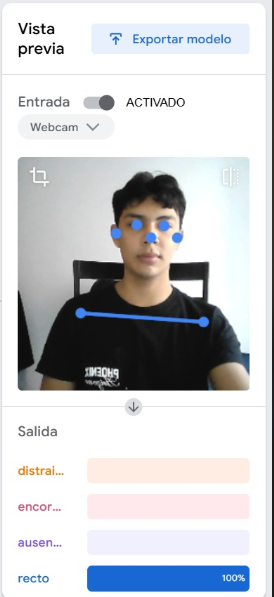
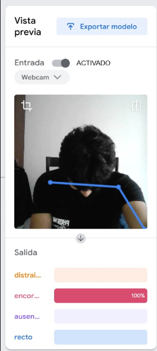
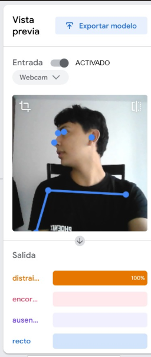
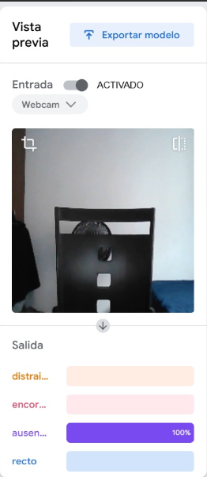

#  Modelo de Detección de Postura con IA

Este proyecto utiliza Inteligencia Artificial (entrenada mediante Teachable Machine) para detectar en tiempo real la postura y el nivel de atención de una persona frente a la cámara.

##  Equipo de Trabajo
* Alejandro Lopez
* Jhonatan Rueda
* Anderson Buitrago

##  Enlace al Modelo
Puedes probar el modelo en vivo aquí: [Teachable Machine Model](https://teachablemachine.withgoogle.com/models/lukTQjQnd/)

##  Estructura del Proyecto
El repositorio está organizado de la siguiente manera:

* `/data-sets/`: Contiene las imágenes originales utilizadas para entrenar el modelo, divididas por categorías (`Ausente-samples`, `Distraido-samples`, `Encorbado-samples`, `Recto-samples`). En total se usaron más de 40 imágenes por cada clase.
* `/images/`: Capturas de pantalla que evidencian el funcionamiento y las pruebas del modelo detectando cada estado.
* `/model/`: Archivos exportados desde Teachable Machine (`model.json`, `metadata.json`, `model.weights.bin`) listos para ser integrados en una aplicación.

##  Clases Identificadas
El modelo fue entrenado para clasificar los siguientes 4 estados:
1. **Recto:** El usuario mantiene una postura ergonómica y adecuada frente a la pantalla.
2. **Encorvado:** El usuario tiene una mala postura, acercándose demasiado al monitor o encorvando la espalda.
3. **Distraído:** El usuario está presente, pero no está prestando atención a la pantalla (mirando hacia los lados).
4. **Ausente:** No se detecta a ninguna persona en la silla.

##  Evidencias de Funcionamiento
A continuación se muestran las pruebas del modelo en ejecución:

### Detección: Recto

### Detección: Encorvado

### Detección: Distraído

### Detección: Ausente

##  Tecnologías Utilizadas
* Google Teachable Machine
* TensorFlow.js